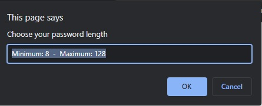
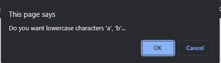
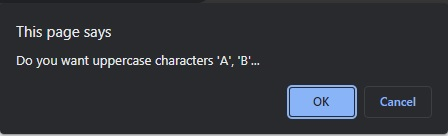
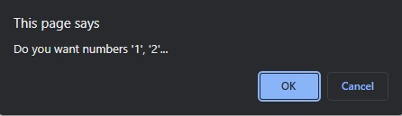
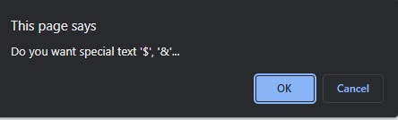
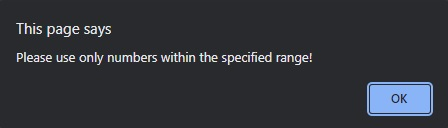
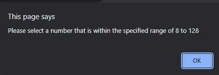
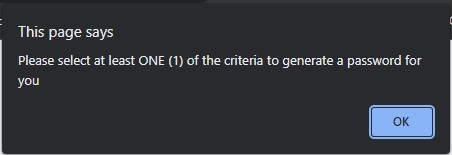

# Password-Generator


## Website URL
https://abhi20220.github.io/Password-Generator/

## Goals
I built this project because the client wanted to create a password generator that had: lowercase, uppercase, numbers and special characters. All within a range of 8 to 128 characters.

## Problems and Solutions
When implementing javascript there were a lot of bugs that were encountered, a common bug that I encountered was that when you click onto generate password, no prompts would appear. Another issue was that the javascript would ask the user what types of characters they want before asking how long do they want their password.

To fix this problem, it turned out that I just had to reshuffle the structure of my javascript because there were things that weren't syncing with each other.

## Completed Requirements

```
1.  User is presented with a series of prompts for a password criteria
2. User is able to select which criteria to include in their password
3. User is able to choose password length when prompted
4. User is able to confirm whether or not they want lowercase, uppercase, numbers and/or special characters
5. User is able to select only one character type if they want
6. If user selects all confirms all prompts then the password that is generated will match the selected criteria
7. When the password is generated it is written on the page
```

## Web Page Overview
The following image shows the web application's appearance and functionality:


The following images are the prompts the user is shown











The following is the error prompts







